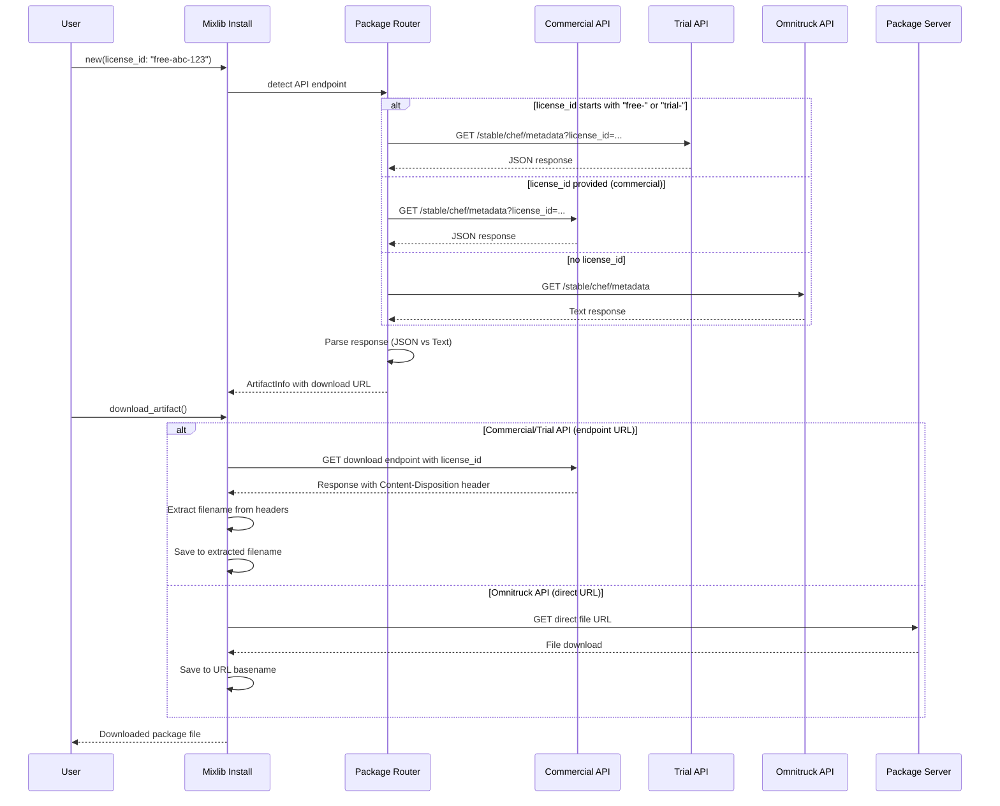

# Architectural Decision Record (ADR)

## November 2025: Commercial and Trial API Support with License-Based Authentication

### Context

Mixlib::Install is a library for interacting with Progress Software: Chef's software distribution systems, providing APIs and command-line tools to download Chef products and generate installation scripts for various platforms. Previously, all package downloads were facilitated through the Omnitruck API (`https://omnitruck.chef.io`), which provided unauthenticated access to Chef products.

The need arose to implement a more robust distribution system that could:

1. **Support licensed/enterprise customers** with authenticated downloads
2. **Enable trial licenses** for evaluation purposes with controlled access
3. **Implement usage tracking and analytics** to understand product adoption
4. **Provide better security and access control** for commercial distributions
5. **Prepare for future deprecation** of unauthenticated Omnitruck access

The challenge was to implement this authentication mechanism while:
- Maintaining backward compatibility with existing Omnitruck-based downloads
- Supporting all existing platforms and download methods (wget, curl, PowerShell, etc.)
- Handling API response format differences between commercial and legacy systems
- Working with Content-Disposition headers for dynamic filename resolution

### Decision

We implemented a dual-API system with license-based authentication through a `license_id` parameter. The solution introduces two new API endpoints alongside the existing Omnitruck API:

1. **Trial API** (`https://chefdownload-trial.chef.io`): For license IDs starting with `free-` or `trial-`
2. **Commercial API** (`https://chefdownload-commercial.chef.io`): For standard license IDs
3. **Omnitruck API** (`https://omnitruck.chef.io`): Continues to work when no license_id is provided (backward compatible)

The implementation adds a new `license_id` option throughout the mixlib-install stack:
- **Ruby API**: `Mixlib::Install.new(license_id: "...")`
- **CLI**: `mixlib-install download chef -L <license_id>`
- **Generated Scripts**: Both Bourne shell and PowerShell scripts accept and use license_id

**API Routing Logic**:
```ruby
if license_id.start_with?("free-", "trial-")
  endpoint = "https://chefdownload-trial.chef.io"
elsif license_id.present?
  endpoint = "https://chefdownload-commercial.chef.io"
else
  endpoint = "https://omnitruck.chef.io" # Traditional behavior
end
```

**Response Format Handling**:
- **Commercial/Trial APIs**: Return JSON responses with download URLs as endpoints
  ```json
  {
    "url": "https://endpoint/download?params",
    "sha256": "abc123...",
    "version": "18.8.54"
  }
  ```
- **Omnitruck API**: Returns text format with direct file URLs
  ```
  url\thttps://packages.chef.io/files/.../package.rpm
  sha256\tabc123...
  ```

**Content-Disposition Handling**:
Due to the commercial/trial API metadata not containing full download URLs with filenames but rather API endpoints, we implemented a sophisticated Content-Disposition header extraction system:

1. Download to temporary file: `chef-download-temp.$$`
2. Extract filename using three methods (in order of preference):
   - Parse `Content-Disposition` header: `filename="chef-18.8.54-1.el9.x86_64.rpm"`
   - Parse `Location` redirect header for filename in redirect URL
   - Pattern match for common package extensions (`.rpm`, `.deb`, `.pkg`, `.msi`, `.dmg`)
3. Fallback to constructed filename from platform metadata if extraction fails
4. Rename temporary file to final destination with extracted/constructed filename

### Implementation

#### 1. New API Endpoint Constants

```ruby
# lib/mixlib/install/dist.rb
module Mixlib
  class Install
    class Dist
      PRODUCT_ENDPOINT = "https://packages.chef.io".freeze
      OMNITRUCK_ENDPOINT = "https://omnitruck.chef.io".freeze
      # New endpoints
      COMMERCIAL_API_ENDPOINT = "https://chefdownload-commercial.chef.io".freeze
      TRIAL_API_ENDPOINT = "https://chefdownload-trial.chef.io".freeze
    end
  end
end
```

#### 2. License ID Option

```ruby
# lib/mixlib/install/options.rb
SUPPORTED_OPTIONS = [
  # ... existing options ...
  :license_id,
]
```

#### 3. Backend API Routing

```ruby
# lib/mixlib/install/backend/package_router.rb
def endpoint
  @endpoint ||= if use_trial_api?
                  Mixlib::Install::Dist::TRIAL_API_ENDPOINT
                elsif use_commercial_api?
                  Mixlib::Install::Dist::COMMERCIAL_API_ENDPOINT
                else
                  PRODUCT_MATRIX.lookup(options.product_name, options.product_version).api_url
                end
end

def use_trial_api?
  !options.license_id.nil? && !options.license_id.to_s.empty? && 
    options.license_id.start_with?("free-", "trial-")
end

def use_commercial_api?
  !options.license_id.nil? && !options.license_id.to_s.empty? && !use_trial_api?
end

def use_licensed_api?
  use_trial_api? || use_commercial_api?
end
```

#### 4. Versions API Adaptation

```ruby
def versions
  if use_licensed_api?
    # Commercial/trial APIs return simple JSON array
    version_list = get("/#{options.channel}/#{omnibus_project}/versions/all")
    items = version_list.map do |version|
      { "properties" => [{ "key" => "omnibus.version", "value" => version }] }
    end
  else
    # Traditional Omnitruck response
    items = get("/api/v1/#{options.channel}/#{omnibus_project}/versions")["results"]
  end
  items
end
```

#### 5. Artifacts API with License ID in Query Parameters

```ruby
def artifacts_for_version(version)
  if use_licensed_api?
    query = "v=#{version}"
    packages_hash = get("/#{options.channel}/#{omnibus_project}/packages?#{query}")
    # Flatten nested hash: platform -> platform_version -> architecture -> package_info
    results = []
    packages_hash.each do |platform, platform_versions|
      platform_versions.each do |platform_version, architectures|
        architectures.each do |arch, pkg_info|
          results << {
            "omnibus.version" => pkg_info["version"],
            "omnibus.platform" => platform,
            "omnibus.platform_version" => platform_version,
            "omnibus.architecture" => arch,
            "omnibus.sha256" => pkg_info["sha256"],
            # ... other metadata
          }
        end
      end
    end
  else
    # Traditional Omnitruck API
    results = get("/api/v1/#{options.channel}/#{omnibus_project}/#{version}/artifacts")["results"]
  end
  results
end
```

#### 6. Download URL Construction

```ruby
def create_artifact(artifact_map)
  if use_licensed_api?
    # Build query parameter URL with license_id
    download_url = "#{endpoint}/#{options.channel}/#{omnibus_project}/download?" +
                   "p=#{platform}&pv=#{platform_version}&m=#{architecture}&" +
                   "v=#{version}&license_id=#{options.license_id}"
  else
    # Traditional direct file URL
    download_url = "#{base_url}/#{chef_standard_path}"
  end
  
  ArtifactInfo.new(url: download_url, ...)
end
```

#### 7. Bourne Shell Script Changes

```bash
# lib/mixlib/install/generator/bourne/scripts/fetch_metadata.sh.erb

# Use commercial API if license_id is provided, otherwise use omnitruck
if test "x$license_id" != "x"; then
  # Check if license_id starts with 'free-' or 'trial-' for trial API
  case "$license_id" in
    free-*|trial-*)
      base_api_url="https://chefdownload-trial.chef.io"
      ;;
    *)
      base_api_url="https://chefdownload-commercial.chef.io"
      ;;
  esac
  metadata_url="$base_api_url/$channel/$project/metadata?v=$version&p=$platform&pv=$platform_version&m=$machine&license_id=$license_id"
else
  # Omnitruck endpoint
  metadata_url="<%= base_url %>/$channel/$project/metadata?v=$version&p=$platform&pv=$platform_version&m=$machine"
fi

# Parse response based on format
if test "x$license_id" != "x"; then
  # Parse JSON response from commercial/trial API using sed
  download_url=`sed -n 's/.*"url":"\([^"]*\)".*/\1/p' "$metadata_filename"`
  sha256=`sed -n 's/.*"sha256":"\([^"]*\)".*/\1/p' "$metadata_filename"`
else
  # Parse text response from omnitruck
  download_url=`awk '$1 == "url" { print $2 }' "$metadata_filename"`
  sha256=`awk '$1 == "sha256" { print $2 }' "$metadata_filename"`
fi
```

#### 8. Content-Disposition Handling in Shell Script

```bash
# lib/mixlib/install/generator/bourne/scripts/fetch_package.sh

if test "x$use_content_disposition" = "xtrue"; then
  # Download to temp file
  temp_download="$download_dir/chef-download-temp.$$"
  do_download "$download_url" "$temp_download"
  
  # Method 1: Extract from Content-Disposition header
  actual_filename=`grep -i 'content-disposition' $tmp_dir/stderr | \
                   sed -n 's/.*filename="\([^"]*\)".*/\1/p' | head -1`
  
  # Method 2: Extract from Location redirect header
  if test "x$actual_filename" = "x"; then
    actual_filename=`grep -i '^location:' $tmp_dir/stderr | head -1 | \
                     sed 's/.*\///' | sed 's/?.*//'`
  fi
  
  # Method 3: Pattern matching for package extensions
  if test "x$actual_filename" = "x"; then
    actual_filename=`grep -i '\.rpm\|\.deb\|\.pkg\|\.msi\|\.dmg' $tmp_dir/stderr | \
                     sed -n 's/.*\/\([^/?]*\.\(rpm\|deb\|pkg\|msi\|dmg\)\).*/\1/p' | head -1`
  fi
  
  # Fallback: Construct from metadata
  if test "x$actual_filename" = "x"; then
    echo "Warning: Could not extract filename from response headers, using fallback"
    if test "x$platform" = "xel" || test "x$platform" = "xfedora"; then
      actual_filename="chef-${version}-1.${platform}${platform_version}.${machine}.rpm"
    elif test "x$platform" = "xdebian" || test "x$platform" = "xubuntu"; then
      actual_filename="chef_${version}-1_${machine}.deb"
    # ... other platform cases
    fi
  fi
  
  # Rename temp file to actual filename
  download_filename="$download_dir/$actual_filename"
  mv "$temp_download" "$download_filename"
fi
```

#### 9. PowerShell Script Changes

```powershell
# lib/mixlib/install/generator/powershell/scripts/get_project_metadata.ps1.erb

function Get-ProjectMetadata {
  param(
    # ... existing parameters ...
    [string]$license_id
  )
  
  # Use commercial API if license_id is provided
  if ($license_id) {
    if ($license_id -match '^(free-|trial-)') {
      $base_server_uri = 'https://chefdownload-trial.chef.io'
    } else {
      $base_server_uri = 'https://chefdownload-commercial.chef.io'
    }
  }
  
  # Add license_id to query parameters if provided
  if ($license_id) {
    $metadata_array += "license_id=$license_id"
  }
  
  $response = (Get-WebContent $metadata_url).trim()
  
  # Parse based on API type
  if ($license_id) {
    # Parse JSON response
    $json = $response | ConvertFrom-Json
    $package_metadata = @{
      url = $json.url
      sha256 = $json.sha256
      version = $json.version
    }
  } else {
    # Parse text response
    $package_metadata = $response -split '\n' | 
      foreach { $hash = @{} } {$key, $value = $_ -split '\s+'; $hash.Add($key, $value)} {$hash}
  }
}
```

#### 10. CLI Support

```ruby
# lib/mixlib/install/cli.rb
option :license_id,
  desc: "License ID for commercial API downloads",
  aliases: ["-L"]

def download(product_name)
  mixlib_install_options = {
    # ... existing options ...
  }.tap do |opt|
    opt[:license_id] = options[:license_id] if options[:license_id]
  end
end
```

### Sequence Diagram



### Benefits

1. **Enterprise Support**: Licensed/enterprise customers can now access authenticated downloads with proper tracking and access control

2. **Trial Licenses**: Enables time-limited trial licenses for product evaluation with controlled access through the trial API

3. **Usage Analytics**: License-based downloads enable comprehensive usage tracking and analytics to understand product adoption patterns and customer behavior

4. **Enhanced Security**: Provides better access control and security for commercial distributions by requiring authentication via license IDs

5. **Backward Compatibility**: Maintains complete backward compatibility with existing Omnitruck-based installations when no license_id is provided

6. **Cross-Platform Support**: Works seamlessly across all supported platforms and download methods:
   - Bourne shell scripts (wget, curl, fetch, perl, python)
   - PowerShell scripts
   - Direct Ruby API usage
   - CLI tool

7. **Flexible Authentication**: Supports multiple license types through simple prefix-based routing (free-/trial- vs commercial)

8. **Content-Disposition Resilience**: Implements multiple fallback methods for filename extraction, ensuring downloads work even with varying server response formats

9. **Transparent API Selection**: Automatically routes to the appropriate API based on license_id presence and format, requiring no additional configuration

10. **Future-Ready**: Prepares the codebase for the planned deprecation of unauthenticated Omnitruck access

### Alternative Solutions Considered

While specific alternative approaches were evaluated during the design phase, the implementation team considered various options including:

1. **API Key vs License ID**: Using generic API keys versus license-specific identifiers
2. **Authentication Mechanisms**: Various authentication methods including tokens, certificates, or license IDs
3. **Omnitruck Modification vs New Endpoints**: Extending the existing Omnitruck API versus creating dedicated commercial/trial endpoints
4. **Single Endpoint vs Multiple Endpoints**: Using one unified endpoint with authentication versus separate trial and commercial endpoints

The selected approach of using license IDs with separate trial and commercial endpoints was chosen based on:
- Clear separation of concerns between free trials and commercial licenses
- Easier routing and backend infrastructure management
- Better analytics and usage tracking capabilities
- Simplified migration path from existing unauthenticated Omnitruck API

### Performance Considerations

**Content-Disposition Approach**:
The decision to use Content-Disposition headers rather than including filenames directly in URLs was driven by the backend API design where metadata does not contain full download URLs with filenames. Instead, the APIs provide endpoint URLs that return the actual file with filename information in the Content-Disposition header.

This approach:
- Allows backend flexibility in file storage and naming
- Enables dynamic file serving without hardcoded paths in metadata
- Supports better caching and CDN strategies
- Provides abstraction between API URLs and actual file storage

The implementation mitigates any performance concerns through:
- Efficient header parsing with multiple extraction methods
- Minimal additional HTTP roundtrips (header information comes with the download response)
- Fallback filename construction to ensure downloads always succeed

### Future Considerations

1. **Omnitruck Deprecation**: Official Chef binary downloads will require authentication via the new commercial/trial APIs in the future. Unauthenticated Omnitruck downloads will be blocked to ensure proper license compliance and usage tracking.

2. **Migration Timeline**: Organizations using mixlib-install should plan to:
   - Obtain appropriate license IDs for their installations
   - Update automation and CI/CD pipelines to include license_id parameters
   - Test the new API endpoints before Omnitruck deprecation
   - Update documentation and internal procedures for licensed downloads

3. **Enhanced Analytics**: The license-based authentication enables future enhancements for:
   - Detailed usage reporting and analytics dashboards
   - License expiration warnings and notifications
   - Automated license renewal workflows
   - Product usage insights for better customer support

4. **API Evolution**: As the commercial and trial APIs mature, consider:
   - Additional metadata in API responses (license status, expiration dates)
   - Improved error messages for license issues
   - Support for offline license validation
   - Integration with Chef Software's customer portal for license management

5. **Security Enhancements**: Future improvements could include:
   - License ID rotation capabilities
   - Rate limiting based on license tiers
   - Audit logging for download events
   - Integration with identity management systems

6. **Compatibility Matrix**: Maintain clear documentation of:
   - Minimum mixlib-install version required for commercial API support (3.13.0+)
   - Ruby version requirements (2.6+)
   - Platform-specific considerations for script generation
   - Migration guides for users upgrading from pre-3.13 versions

7. **Testing and Validation**: Establish comprehensive testing for:
   - All three API endpoints (omnitruck, trial, commercial)
   - Content-Disposition header extraction across various HTTP clients
   - Fallback filename construction for all supported platforms
   - JSON vs text response parsing in both shell and PowerShell scripts
   - Error handling for invalid or expired license IDs

### Impact Assessment

**Breaking Changes**: None. The implementation is fully backward compatible with existing usage patterns.

**Required Updates**: Organizations wishing to use commercial/trial API features must:
1. Update to mixlib-install 3.13.0 or later
2. Obtain license IDs from Progress Software: Chef
3. Update scripts and automation to include license_id parameters (optional but recommended)

**Documentation Updates**: 
- Updated README.md with license_id usage examples
- Added Copilot instructions documenting commercial/trial API integration
- Updated PRODUCT_MATRIX.md with new chef-ice product
- Enhanced CLI help text with license_id option

**Testing Coverage**: Comprehensive tests added for:
- API endpoint detection and routing logic
- JSON vs text response parsing
- Content-Disposition header extraction
- License ID parameter handling in CLI, Ruby API, and generated scripts
- Backward compatibility with omnitruck-based downloads
